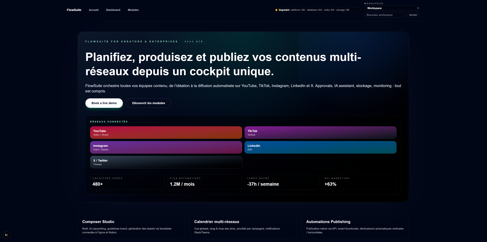
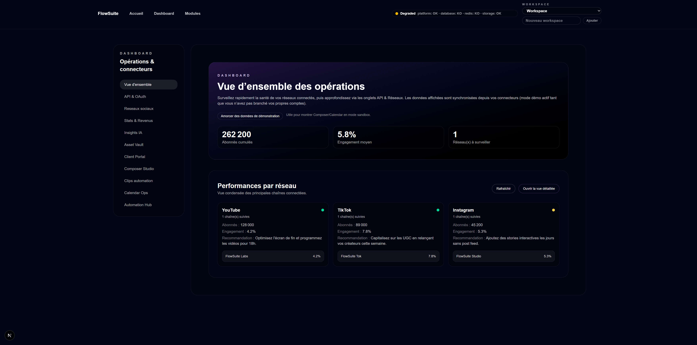
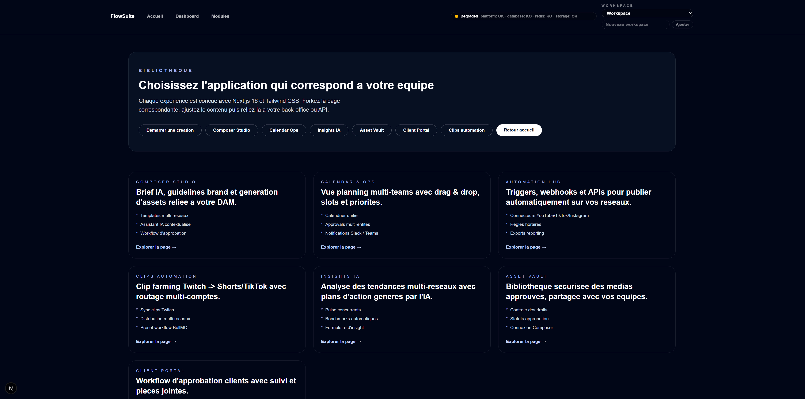

<div align="center" style="font-family:Inter,\"Segoe UI\",sans-serif;background:linear-gradient(135deg,#0f172a,#020617);color:#e2e8f0;padding:48px;border-radius:32px;margin-bottom:32px;">
  <p style="letter-spacing:0.35em;text-transform:uppercase;color:#38bdf8;font-size:12px;margin:0;">FlowSuite</p>
  <h1 style="font-size:48px;margin:12px 0 16px;">Content Ops SaaS</h1>
  <p style="max-width:720px;font-size:15px;margin:0 auto;line-height:1.6;">
    Composez, planifiez, automatisez et désormais recyclez vos clips Twitch → TikTok/YouTube Shorts
    dans une seule stack Next.js 16 + Tailwind. Pensé pour impressionner sur GitHub et pour être déployé
    partout (Vercel, Render, Docker, bare metal).
  </p>
  <div style="margin-top:24px;display:flex;gap:12px;flex-wrap:wrap;justify-content:center;">
    <a href="mailto:twk666@proton.me" style="background:#38bdf8;color:#0f172a;padding:10px 20px;border-radius:999px;font-weight:600;text-decoration:none;">twk666@proton.me</a>
    <span style="border:1px solid rgba(226,232,240,.3);padding:10px 20px;border-radius:999px;font-weight:600;">Next.js 16 · Tailwind 3.4 · Prisma</span>
  </div>
</div>

> 
<p align="center">
  
</p>
<p align="center">
  
</p>
<p align="center">
  
</p>


---

## 🇫🇷 Modules inclus
| Module | Description | Points clés |
| --- | --- | --- |
| **Composer Studio** | Briefs IA, guidelines brand, génération multi-réseaux, uploads chunkés YouTube/TikTok, formulaires Instagram/LinkedIn/X. | File d’upload persistante, historique (Postgres si dispo), monitoring en temps réel. |
| **Calendar Ops** | Timeline, kanban et approvals avec export ICS/Google Calendar. | Drag & drop, filtres équipes/réseaux, alertes Slack, BullMQ scheduler si Redis. |
| **Automation Hub** | Workflows prêts (UGC Flow, Product Launch, Crisis mode) + API `/api/automations/*`. | Simulation, logs détaillés, déclencheurs HTTP/Slack. |
| **Clips Automation** | Sync Twitch → distribution multi comptes TikTok/YouTube Shorts (standalone + Dashboard). | Sélection de clips, multi-accounts selector, jobs envoyés vers la file uploads. |
| **Dashboard Ops** | Vue d’ensemble, API & OAuth, Réseaux sociaux, Stats & revenus, Composer, Calendar, Automation, Clips. | Voyants connecteurs (vert/orange/rouge), presets redirect, checklist onboarding. |

---

## ⚙️ Stack & fiabilité
- **Frameworks** : Next.js 16 (App Router), TypeScript, Tailwind 3.4, Radix UI.
- **Backend** : Prisma + Postgres/Supabase (fallback mémoire si `DATABASE_URL` vide), BullMQ + Redis (ou exécution synchrone), stockage local/S3/MinIO via `STORAGE_PROVIDER`.
- **Observabilité** : `/api/health` & `/api/health/ready`, logger Pino JSON, notifications Slack (`src/server/services/slack.ts`).
- **Mode démo** : sans DB/Redis/S3, toutes les données restent en mémoire → parfait pour présenter FlowSuite sans secrets.

---

## 🚀 Mise en route rapide
```bash
npm install
cp .env.example .env.local
npm run dev
```
Variables minimales :
```env
NEXT_PUBLIC_APP_URL=http://localhost:3000
STORAGE_PROVIDER=local
```
*(Laissez `DATABASE_URL` et `REDIS_URL` vides pour rester en mode démo. Ajoutez-les quand vous souhaitez brancher Supabase/Upstash.)*

Ouvrez `http://localhost:3000`, choisissez un workspace (mock par défaut) et profitez du sandbox complet.

---

## 🔑 Connecteurs & OAuth
- Dashboard > API vous permet d’enregistrer `client_id` / `client_secret` / `redirect_uri` pour YouTube, TikTok, Instagram, LinkedIn, X/Twitter, Twitch (avec liens docs officiels).
- Chaque réseau affiche le nombre de comptes connectés + voyants colorés.
- Composer/Clips utilisent ces comptes pour alimenter les sélecteurs multi-publications.

---

## 📡 Endpoints importants
| Route | Usage |
| --- | --- |
| `GET /api/health` | Liveness (DB/Redis/stockage). |
| `GET /api/health/ready` | Readiness avec statut `ready/degraded`. |
| `GET /api/connectors` | État OAuth (Dashboard/Composer/Clips). |
| `POST /api/upload/youtube/*` | Session chunk, envoi de chunks, finalisation. |
| `POST /api/upload/twitter` / `POST /api/upload/linkedin` / etc. | Publication directe depuis Composer. |
| `GET /api/schedules` & `POST /api/schedules` | Slots Calendar Ops. |
| `POST /api/clips/publish` | Distribution des clips Twitch vers TikTok/YouTube. |

---

## 🛠️ Déploiement
- **Docker** : `npm run build && npm run start` (Dockerfile fournit la config de prod). Réglez vos variables env avant de builder.
- **Vercel / Render / Fly.io** : même env (`NEXT_PUBLIC_APP_URL`, credentials réseaux, `STORAGE_PROVIDER`).
- **Worker BullMQ** : `npm run worker` pour traiter les jobs (uploads/automations) dès que `QUEUE_PROVIDER=redis` est défini.

---

## 🧪 Tests & lint
```bash
npm run lint   # ESLint + TS
npm run test   # Vitest (ajoutez vos suites)
```
Playwright est prêt dans `tests/e2e` pour des scénarios UI si besoin.

----------------------------------------------------------------------------------------------------------------------------------------

## 🇬🇧 Included Modules
| Module | Description | Highlights |
| --- | --- | --- |
| **Composer Studio** | AI briefs, brand guidelines, multi-network generation, resumable YouTube/TikTok uploads, Instagram/LinkedIn/X forms. | Persistent upload queue, Postgres-ready history, live monitoring. |
| **Calendar Ops** | Timeline, kanban & approvals with ICS/Google export. | Drag & drop, team/network filters, Slack alerts, BullMQ scheduler when Redis is available. |
| **Automation Hub** | Ready-to-use workflows (UGC Flow, Product Launch, Crisis mode) + `/api/automations/*`. | Simulation, detailed logs, HTTP/Slack triggers. |
| **Clips Automation** | Twitch sync → multi-account TikTok/YouTube Shorts distribution (standalone + dashboard tab). | Clip selector, multi-account picker, jobs pushed to the upload queue. |
| **Dashboard Ops** | Overview, API & OAuth, Socials, Revenue, Composer, Calendar, Automation, Clips. | Connector indicators, redirect presets, onboarding checklist. |

---

## ⚙️ Stack & Reliability
- **Frameworks**: Next.js 16 (App Router), TypeScript, Tailwind 3.4, Radix UI.
- **Backend**: Prisma + Postgres/Supabase (memory fallback when `DATABASE_URL` is missing), BullMQ + Redis (or synchronous exec), storage via `STORAGE_PROVIDER` (local/S3/MinIO).
- **Observability**: `/api/health` & `/api/health/ready`, Pino JSON logger, Slack notifications (`src/server/services/slack.ts`).
- **Demo mode**: without DB/Redis/S3 everything stays in-memory → perfect to showcase FlowSuite without any secret.

---

## 🚀 Quick Start
```bash
npm install
cp .env.example .env.local
npm run dev
```
Minimal env:
```env
NEXT_PUBLIC_APP_URL=http://localhost:3000
STORAGE_PROVIDER=local
```
*(Leave `DATABASE_URL` & `REDIS_URL` empty to keep the in-memory sandbox. Add them once you plug Supabase/Upstash.)*

Open `http://localhost:3000`, pick the default workspace and enjoy the sandbox experience.

---

## 🔑 Connectors & OAuth
- Dashboard > API lets you store each `client_id` / `client_secret` / `redirect_uri` for YouTube, TikTok, Instagram, LinkedIn, X/Twitter, Twitch (with official docs links).
- Every network card shows how many accounts are connected + a colored indicator.
- Composer/Clips read these accounts to populate the publishing selectors.

---

## 📡 Key Endpoints
| Route | Purpose |
| --- | --- |
| `GET /api/health` | Liveness (DB/Redis/storage). |
| `GET /api/health/ready` | Readiness with `ready/degraded` status. |
| `GET /api/connectors` | OAuth state consumed by Dashboard/Composer/Clips. |
| `POST /api/upload/youtube/*` | Session setup, chunk upload & finalization. |
| `POST /api/upload/twitter` / `POST /api/upload/linkedin` / etc. | One-click posting from Composer. |
| `GET /api/schedules` & `POST /api/schedules` | Calendar Ops slots. |
| `POST /api/clips/publish` | Twitch clip distribution to TikTok/YouTube. |

---

## 🛠️ Deployment
- **Docker**: `npm run build && npm run start` (Dockerfile ready). Set env vars before building.
- **Vercel / Render / Fly.io**: same env (`NEXT_PUBLIC_APP_URL`, provider credentials, `STORAGE_PROVIDER`).
- **BullMQ worker**: `npm run worker` once `QUEUE_PROVIDER=redis` to process upload/automation jobs.

---

## 🧪 Tests & Lint
```bash
npm run lint   # ESLint + TS
npm run test   # Vitest (add your suites)
```
Playwright is scaffolded inside `tests/e2e` for UI scenarios.

---

## 🇬🇧 English TL;DR
- Next.js 16 + Tailwind powered dashboard bundling Composer Studio, Calendar Ops, Automation Hub, Clips Automation.
- Works with Postgres/Supabase + Prisma, Redis/BullMQ, S3/MinIO, but keeps an in-memory demo fallback.
- Plug OAuth credentials from the Dashboard, trigger uploads (YouTube/TikTok) and clip farming (Twitch → TikTok/Shorts).
- Deploy anywhere (Docker, Vercel, Render, Fly.io). Contact us for enterprise support → [contact@flowsuite.app](mailto:contact@flowsuite.app).

---
